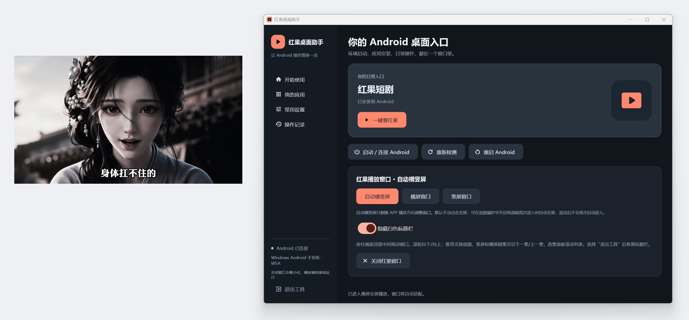

# 红果桌面助手 · Hongguo Desktop Helper

**让 Agent 在 Windows 11 上安装红果短剧安卓 APP（APK），以无标题栏、无边框的独立桌面小窗播放 1080P 高清画面和 APP 原声音，一边看短剧，一边办公。**

像模拟器一样安装安卓 APP，通过 WSA 安卓子系统在电脑里运行，使用体验像 Windows 桌面播放器。视频在可移动的独立小窗里播放，把电脑屏幕留给其他办公软件；助手只负责窗口与操作辅助，画面和声音直接由 APP 播放。

- **画质与声音**：使用 APP 自己的播放链路和 1080P 高清档位，助手不额外压缩或转码音视频。
- **边看边办公**：无边框视频小窗与管理工具分开，拖动画面顶部即可移动，不用占满电脑屏幕。
- **电脑追剧操作**：跟随视频自动横竖屏，鼠标滚轮切换推荐视频或剧集，保护已记录的观看进度。

默认手动点击 APP 的全屏按钮：**这里的“全屏”是在播放小窗内展开视频，播放器仍是独立桌面窗口，默认不会铺满电脑屏幕。**“自动横竖屏”只调整窗口方向；可选自动全屏在同一助手会话中，仅对从推荐页首次进入的每部剧触发一次。

## 小窗播放，边看边办公

左边是实际播放中的 **960 × 540 无边框视频小窗**，右边是 Python 管理工具。两者在同一台 Windows 电脑上同时运行；小窗可以移动到方便观看的位置，鼠标在其他软件中操作时，助手不会接管滚轮。



实拍只保留播放器和管理工具，背景使用临时纯色窗口遮挡，未截入桌面文件、其他应用或个人工作内容。

## 复制给 Agent，自动安装

**推荐通过 Agent 调用本仓库安装。**Agent 会准备安卓环境、助手和 APK 连接；只下载一个 EXE 或 ZIP 不会完成这些步骤。安装完成后，日常直接使用快捷方式。

把下面整段复制给 **Codex、DSH（DeepSeek Harness）或具备本机操作能力的豆包等 Agent**。当前 Agent 会话需要能在你的 Windows 本机执行 PowerShell 命令；纯云端聊天会话需要切换到具备本机执行能力的 Agent。

```text
请直接在我这台 Windows 电脑上安装“红果桌面助手”：
https://github.com/xiaotu6e/hongguo-desktop

我要在无边框的独立桌面小窗里看短剧，同时使用其他办公软件。请实际完成安装并启动，不要只给教程。

先确认能执行本机 PowerShell、系统为 Windows 11 x64。下载或克隆仓库到固定目录，读取 README.md、AGENTS.md、docs/installation.md 和 docs/agent-prompts.md，再按照安装提示词执行。

优先使用 manifests/release.json 指定的 Release 成品，通过 scripts/install.ps1 安装并校验 SHA-256；先 -DryRun，再实际安装。已有 WSA 和红果 APP 就复用；缺少 WSA 时按文档安装，缺少红果时请我提供本地 APK 路径。仅在遇到文档对应的启动或解码问题时执行兼容修复。

保留账号和观看记录，设为自动横竖屏、隐藏标题栏、默认手动全屏。这里的全屏是在小窗内展开视频，不是铺满电脑屏幕。

需要管理员授权、重启、开发人员模式、ADB 授权或登录时，只告诉我当前一步怎么做，完成后继续。创建快捷方式，运行 scripts/doctor.ps1 -Json，启动助手和红果，最后用简单中文报告版本、快捷方式位置和完成情况。
```

[完整安装提示词与更新提示词](docs/agent-prompts.md) · [安装步骤](docs/installation.md)

## 更新了什么，需要更新哪里

查看 [逐版本更新记录](CHANGELOG.md)。Agent 更新前会读取 [组件更新清单](manifests/updates.json)，运行 `scripts/update-plan.ps1 -Json`，说明当前版本 → 目标版本及需要处理的组件。

**v0.1.0 → v0.1.1：更新助手完整程序，修复退出全屏后重复进入；检查旧的自动全屏偏好。WSA 和红果 APP 无需重装，账号、观看记录与其他设置保留。**本次补充文档和截图，助手成品仍为 v0.1.1，已更新的用户无需再装一遍。

复制下面这段，让 Agent 帮你更新：

```text
请实际更新我电脑上的红果桌面助手：
https://github.com/xiaotu6e/hongguo-desktop
先读取 AGENTS.md、CHANGELOG.md、docs/updating.md 和 docs/agent-prompts.md，按更新提示词执行。核对本机实际版本，运行 scripts/update-plan.ps1 -Json；先告诉我这次改了什么、需要更新哪些组件、哪些组件不用更新，再继续完成更新。保留 WSA、红果账号、观看记录和其他设置。我要默认手动全屏；从旧版更新时检查并关闭旧的自动全屏偏好。更新后确认实际启动版本、原快捷方式和 scripts/doctor.ps1 的检查结果。如果助手成品已是当前版本，只同步仓库文档和 Agent 脚本，不重复重装。
```

[当前 v0.1.1 成品和源码包](https://github.com/xiaotu6e/hongguo-desktop/releases/tag/v0.1.1) · [Agent 更新步骤](docs/updating.md)

## 实际播放效果

### 横屏无边框播放

16:9 独立播放窗口，直接显示红果 APP 的视频画面。


点出播放控件即可查看进度、切换清晰度和选集；下面是 APP 已显示 1080P 的实际界面。


### 推荐页与竖屏播放

推荐页保留完整安卓界面；进入剧集后，播放器自动适应横屏或竖屏。

<table>
  <tr>
    <th>推荐页 · 滚轮换视频</th>
    <th>竖屏播放 · 无窗口外框</th>
  </tr>
  <tr>
    <td width="50%"></td>
    <td width="50%"></td>
  </tr>
</table>

### 助手操作界面

一键打开红果、切换播放窗口模式、拖入 APK 安装，都在中文界面中完成。


## 运行环境

支持 **Windows 11 x64**，通过 WSA 运行用户提供的安卓 APK。Agent 优先安装已发布成品，可省去 Python 和编译环境；选择源码方式需要 Python 3.11+。WSA 来源、系统准备与必要授权见 [安装说明](docs/installation.md) 和 [第三方组件](docs/third-party.md)。

## 安装后检查

```powershell
powershell -NoProfile -ExecutionPolicy Bypass -File .\scripts\doctor.ps1
```

检查助手、WSA、ADB、连接和 APK。退出码 0 表示这些检查通过，2 表示缺失组件，3 表示连接需处理；**真实画面、声音、切集和横竖屏仍需确认**。

## 文档

本仓库公开 Python/Flet 源码、Java 页面读取组件、C++ 窗口组件，以及安装、环境检查、WSA 兼容修复和恢复脚本。当前安卓运行环境只支持 WSA。

- [安装、Agent 操作及断点恢复](docs/installation.md)
- [直接复制的 Agent 安装与更新提示词](docs/agent-prompts.md)
- [逐版本更新记录](CHANGELOG.md)
- [组件更新与数据保留说明](docs/updating.md)
- [使用方法](docs/usage.md)
- [WSA 兼容修复、版本限制及恢复](docs/compatibility.md)
- [开发、构建和发布](docs/development.md)
- [验证范围](docs/validation.md)
- [第三方来源与许可证](docs/third-party.md)

源码采用 MIT 许可证。个人观看记录、配置、日志、系统镜像和 APK 不提交到本仓库。该项目为独立工具，与红果或微软没有官方关联。
