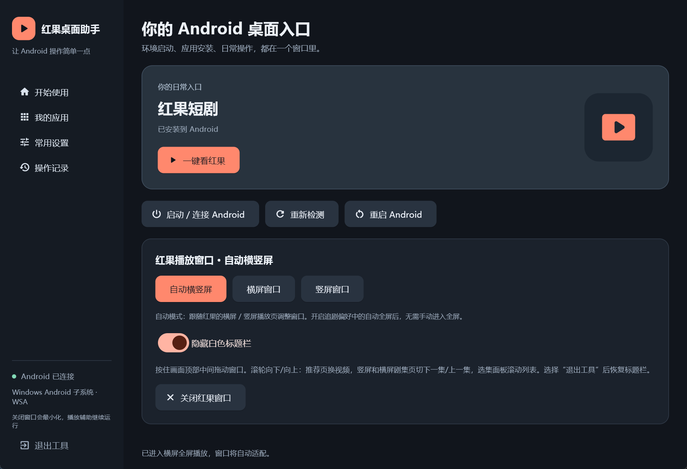

# 红果桌面助手 · Hongguo Desktop Helper

**在 Windows 11 上安装红果短剧安卓 APP（APK），通过 WSA 安卓子系统直接播放 APP 的原画质、原声音，支持 1080P 高清、无标题栏无边框、自动横竖屏和鼠标滚轮切集。**

安装方式类似安卓模拟器，使用体验像 Windows 桌面播放器：APP 直接在电脑里运行，以独立窗口播放，融入任务栏和桌面。助手只负责窗口与操作辅助，画面和声音直接由 APP 播放，保留原有播放效果。

- **画质与声音**：使用 APP 自己的播放链路和 1080P 高清档位，助手不额外压缩或转码音视频。
- **无边框播放**：隐藏 Windows 标题栏与外框，保留完整画面；拖动画面顶部即可移动窗口。
- **电脑追剧操作**：跟随视频自动横竖屏，鼠标滚轮切换推荐视频或剧集，保护已记录的观看进度。

## 实际播放效果

### 横屏无边框播放

16:9 独立播放窗口，直接显示红果 APP 的视频画面。


点出播放控件即可查看进度、切换清晰度和选集；下面是 APP 已显示 1080P 的实际界面。


### 推荐页与竖屏播放

推荐页保留完整安卓界面；进入剧集后，播放器自动适应横屏或竖屏。

<table>
  <tr>
    <th>推荐页 · 滚轮换视频</th>
    <th>竖屏播放 · 无窗口外框</th>
  </tr>
  <tr>
    <td width="50%"></td>
    <td width="50%"></td>
  </tr>
</table>

### 助手操作界面

一键打开红果、切换播放窗口模式、拖入 APK 安装，都在中文界面中完成。



## 给本机 Agent 的安装指令

把仓库链接和下面这段话发给能在 Windows 本机执行终端命令的 Agent：

> 请安装这个项目。先阅读 README.md、AGENTS.md 和 docs/installation.md，检查当前 Windows、Python、WSA 与开发人员模式。执行 scripts/install.ps1 安装助手，再运行 scripts/doctor.ps1。WSA 未安装时使用 -InstallWsa；确需复现文档中的启动/解码修复时使用 -RepairWsa。保留已有应用和观看数据。需要管理员、重启或安卓授权时，说明具体步骤；完成后启动助手，报告检查结果与仍需人工确认的播放项目。

## 快速安装

支持范围：**Windows 11 x64**。源码运行需要 Python 3.11+。微软商店自 2025-03-05 起不再提供 WSA；本项目记录并使用 WSABuilds 的指定社区发行版本。来源见 [第三方组件](docs/third-party.md)。

已安装 WSA，且 Python 可从终端运行：

```powershell
git clone https://github.com/xiaotu6e/hongguo-desktop.git
Set-Location hongguo-desktop
powershell -NoProfile -ExecutionPolicy Bypass -File .\scripts\install.ps1 -Launch
```

新电脑完整安装命令（管理员 PowerShell；Python 和 WSL 准备见安装说明）：

```powershell
powershell -NoProfile -ExecutionPolicy Bypass -File .\scripts\install.ps1 -InstallWsa -RepairWsa -EnableVirtualization -Launch
```

兼容修复需要 WSL Ubuntu、Linux Python 3.9+ 和镜像工具。首次启用虚拟化需要重启后再次运行相同命令。WSA 开发人员模式与首次 ADB 授权需要在系统界面完成。APK 由用户提供，仓库不包含红果 APK。

先预览安装步骤，不下载、不修改系统、不启动应用：

```powershell
powershell -NoProfile -ExecutionPolicy Bypass -File .\scripts\install.ps1 -DryRun -InstallWsa -RepairWsa -Launch
```

已发布 [v0.1.0 成品和源码包](https://github.com/xiaotu6e/hongguo-desktop/releases/tag/v0.1.0)，可跳过 Python 环境安装：

```powershell
powershell -NoProfile -ExecutionPolicy Bypass -File .\scripts\install.ps1 -Mode Release -Version v0.1.0 -Launch
```

成品下载和源码入口分别在仓库的 Releases 和 Code 页面；安装脚本依照 `manifests/release.json` 校验成品。已有 WSA/APK 的用户也可将成品 ZIP 解压到固定目录后，双击 hongguo_desktop.exe。

## 安装后检查

```powershell
powershell -NoProfile -ExecutionPolicy Bypass -File .\scripts\doctor.ps1
```

检查助手、WSA、ADB、连接和 APK。退出码 0 表示这些检查通过，2 表示缺失组件，3 表示连接需处理；**真实画面、声音、切集和横竖屏仍需确认**。

## 文档

本仓库公开 Python/Flet 源码、Java 页面读取组件、C++ 窗口组件，以及安装、环境检查、WSA 兼容修复和恢复脚本。当前安卓运行环境只支持 WSA。

- [安装、Agent 操作及断点恢复](docs/installation.md)
- [使用方法](docs/usage.md)
- [WSA 兼容修复、版本限制及恢复](docs/compatibility.md)
- [开发、构建和发布](docs/development.md)
- [验证范围](docs/validation.md)
- [第三方来源与许可证](docs/third-party.md)

源码采用 MIT 许可证。个人观看记录、配置、日志、系统镜像和 APK 不提交到本仓库。该项目为独立工具，与红果或微软没有官方关联。
